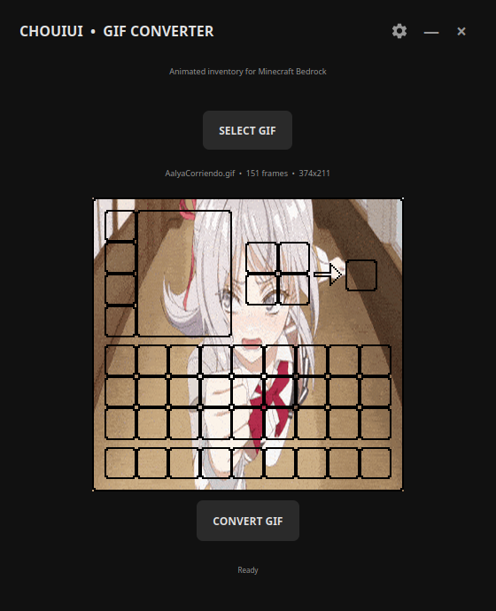
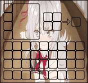

# ChouiUI GIF Converter 1.0

Convert any GIF into an animated `.mcpack` resource pack for Minecraft Bedrock using the ChouiUI v2.3 template.

## Scope of the generated pack
This release changes only the player's inventory screen in **Survival and Creative**. Crafting tables, furnaces, smokers, blast furnaces, brewing stands, anvils, enchanting tables, chests and other workstation screens are left to Bedrock's vanilla UI. Creative keeps the vanilla block/item browser, with a Creative-only hamburger control mapped to the next inventory section.

## Features

- Matching clean dark interface on Windows and Android.
- Windows UI built with PySide6 in a frameless window with no maximize control.
- One main action button and a compact gear dialog for choosing the `.mcpack` export folder.
- Animated GIF preview using the same selected frames and overall timing as the generated pack.
- The converter uses a train of up to eight safe flipbook atlases. Each carriage contains at most 23 frames (`23 × 352 = 8096px`, below the common 8192px texture limit), and JSON UI alpha animations hand off from one carriage to the next. GIFs longer than 184 frames are sampled uniformly while preserving the complete loop duration, preventing oversized textures from crashing Bedrock.
- `pack_icon.png` generated from the first frame of the selected GIF.
- Application icon adapted from the supplied Minecraft inventory image.
- A new UUID is generated for every conversion.

## Windows

Install Python 3.8+ and the dependencies:

```bash
pip install -r requirements.txt
python main.py
```

The portable Windows executable is published as `ChouiGIFConverter.exe`.

## Android

The native Android project is located in `android/` and uses the same visual layout, gear dialog, dark colors and animated preview.

```bash
cd android
./gradlew assembleRelease
```

The Android package is published as `ChouiGIFConverter.apk` with version name `1.0`.

## Usage

Select a GIF and press the main button. The preview animates at the same overall speed as the generated pack. Press the gear icon in the top-right corner to choose an output folder. If no custom folder is selected, Windows saves the `.mcpack` next to the GIF and Android opens the system save dialog.

## Preview and drag & drop

The Windows preview uses Qt's native `QMovie` decoder, so it displays every original GIF frame with the GIF's own timing. Drop a `.gif` file anywhere on the application window to load it immediately; the normal file picker remains available through **SELECT GIF**.

## Real preview

The following evidence uses the supplied `AalyaCorriendo.gif`, not a synthetic blue test image. The PNG is captured from the running Windows application. The animated GIF is generated from the same frame compositor used by the Android conversion path, so it shows the real inventory overlay and the original GIF motion without claiming to be an emulator recording.





[Download the original demo GIF](docs/media/AalyaCorriendo-original.gif)

The original frame delays are retained when the desktop preview is played. Pack export uses the average timing required by Bedrock's integer `fps` flipbook format and preserves the complete loop duration across all atlas carriages.

## Retro archive

The `archive/2019/` directory is a deliberately labeled retro-style archive containing harmless placeholder notes and a legacy launcher mockup. It is included for the old seven-year-old repository aesthetic requested for this project; it does **not** claim that the current application or those files were originally created in 2019. The actual Git history remains unchanged and keeps its real dates.
