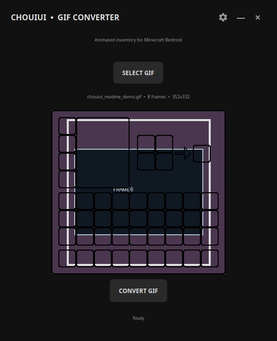
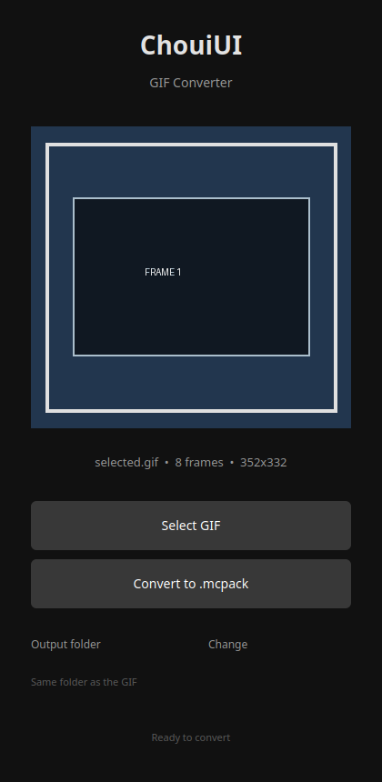

# ChouiUI GIF Converter 1.0

Convert any GIF into an animated `.mcpack` resource pack for Minecraft Bedrock using the ChouiUI v2.3 template.

## Scope of the generated pack

This 1.0 release changes only the player's inventory screen. **Survival and Creative use the same animated Java-style inventory UI**; the Creative block browser and its full block list are intentionally not added. The pack does not override the crafting table, furnace, smoker, blast furnace, brewing stand, anvil, enchanting table, redstone or chest screens. The game's original UI remains active everywhere else.

Both desktop and pocket inventory definitions use the same `java_inventory_panel` in survival and Creative mode.

## Features

- Matching clean dark interface on Windows and Android.
- Windows UI built with PySide6 in a frameless window with no maximize control.
- One main action button and a compact gear dialog for choosing the `.mcpack` export folder.
- Animated GIF preview using the same selected frames and overall timing as the generated pack.
- The flipbook frame count is generated from the original GIF: every source frame is exported and `frame_count` is patched to that exact number. There is no hardcoded 11- or 23-frame limit in Windows or Android.
- `pack_icon.png` generated from the first frame of the selected GIF.
- Application icon adapted from the supplied Minecraft inventory image.
- A new UUID is generated for every conversion.

## Windows

Install Python 3.8+ and the dependencies:

```bash
pip install -r requirements.txt
python main.py
```

The portable Windows executable is published as `ChouiGIFConverter.exe`.

## Android

The native Android project is located in `android/` and uses the same visual layout, gear dialog, dark colors and animated preview.

```bash
cd android
./gradlew assembleRelease
```

The Android package is published as `ChouiGIFConverter.apk` with version name `1.0`.

## Usage

Select a GIF and press the main button. The preview animates at the same overall speed as the generated pack. Press the gear icon in the top-right corner to choose an output folder. If no custom folder is selected, Windows saves the `.mcpack` next to the GIF and Android opens the system save dialog.

## Preview and drag & drop

The Windows preview uses Qt's native `QMovie` decoder, so it displays every original GIF frame with the GIF's own timing. Drop a `.gif` file anywhere on the application window to load it immediately; the normal file picker remains available through **SELECT GIF**.

## Screenshots

The Windows image below is captured from the running desktop application with a demo GIF loaded. The Android image is a rendered reference of the native layout included in `android/`; it is kept in the repository so the two interfaces can be compared without requiring an emulator.





## Retro archive

The `archive/2019/` directory is a deliberately labeled retro-style archive containing harmless placeholder notes and a legacy launcher mockup. It is included for the old seven-year-old repository aesthetic requested for this project; it does **not** claim that the current application or those files were originally created in 2019. The actual Git history remains unchanged and keeps its real dates.
